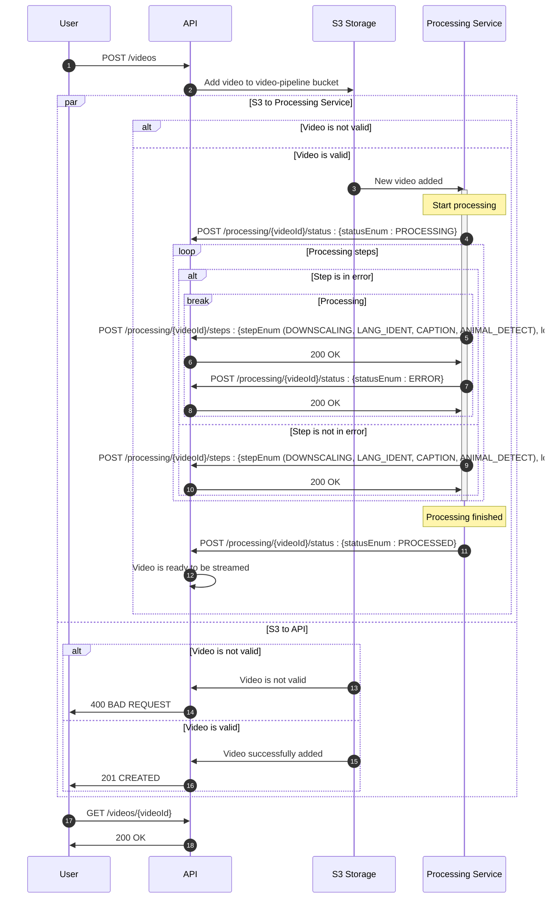

# Video-API

## Description

This API is used to manage videos and their metadata. Plus, it allows user access processing status of videos.

## Creation of a video

```mermaid
sequenceDiagram
    autonumber
    participant U as User
    participant A as API
    participant S3 as S3 Storage
    participant S as Processing Service
    U ->> A: POST /videos
    A ->> S3: Add video to video-pipeline bucket
    par S3 to Processing Service
        alt Video is not valid
        else Video is valid
            S3 ->> S: New video added
            activate S 
            Note over S: Start processing
            S ->> A: POST /processing/{videoId}/status : {statusEnum : PROCESSING}
            loop Processing steps
                alt Step is in error
                    break Processing
                        S ->> A: POST /processing/{videoId}/steps : {stepEnum (DOWNSCALING, LANG_IDENT, CAPTION, ANIMAL_DETECT), log}
                        A ->> S: 200 OK
                        S ->> A: POST /processing/{videoId}/status : {statusEnum : ERROR}
                        A ->> S: 200 OK
                    end
                else Step is not in error
                    S ->> A: POST /processing/{videoId}/steps : {stepEnum (DOWNSCALING, LANG_IDENT, CAPTION, ANIMAL_DETECT), log}
                    A ->> S: 200 OK
                end
            end
            deactivate S
            Note over S: Processing finished
            S ->> A: POST /processing/{videoId}/status : {statusEnum : PROCESSED}
            A ->> A: Video is ready to be streamed
        end
    and S3 to API
        alt Video is not valid
            S3 ->> A: Video is not valid
            A ->> U: 400 BAD REQUEST
        else Video is valid
            S3 ->> A: Video successfully added
            A ->> U: 201 CREATED
        end
    end
    U ->> A: GET /videos/{videoId}
    A ->> U: 200 OK
```
